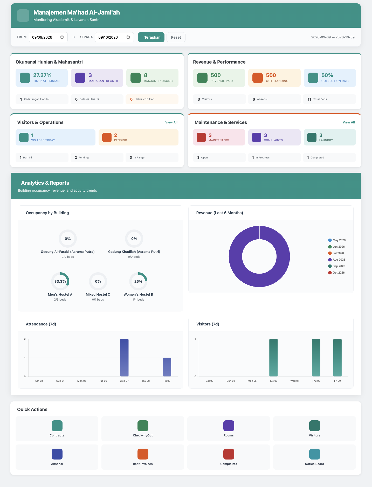

# Modul Manajemen Hunian & Sarana Asrama Ma'had Al-Jami'ah PTKIN
## (sirita_mahad)

Modul utama Odoo untuk tata kelola operasional hunian fisik, inventaris sarana prasarana, logistik konsumsi, dan administrasi keuangan asrama Ma'had Al-Jami'ah di lingkungan Perguruan Tinggi Keagamaan Islam Negeri (PTKIN).

Modul ini menyediakan instrumen terintegrasi untuk pengawasan fasilitas asrama, pemantauan daya tampung santri secara langsung (real-time), serta terhubung dengan modul akuntansi lembaga.



---

### Informasi Modul
- Nama Teknis: sirita_mahad
- Nama Aplikasi: Sirita Ma'had Al-Jami'ah — Sistem Informasi Manajemen Asrama PTKIN
- Kategori: Hostel / Dormitory Management
- Versi: 20.0.1.0
- Lisensi: LGPL-3
- Penulis / Author: sufyALDI | TIPD IAIN Parepare
- Pengembang  / Upstream Author Modul Basis: Webbycrown Solutions (https://www.webbycrown.com/)
- Dependensi: base, web, mail, hr, account

---

### Ruang Lingkup dan Fitur Utama

#### 1. Dashboard Monitoring & Analisis Okupansi
- Kartu indikator kinerja utama (KPI) hunian santri, ketersediaan ranjang, rekapitulasi tamu harian, tiket perbaikan fasilitas, dan tunggakan tagihan asrama.
- Visualisasi grafik interaktif untuk rasio okupansi antar gedung hunian dan tren keuangan bulanan/semesteran.

#### 2. Master Data Struktur Hunian Bertingkat
- Gedung Asrama: Pengelompokan fisik gedung dengan proteksi pembagian gender (Asrama Putra / Asrama Putri).
- Blok & Lantai: Zonasi lantai atau sayap hunian di dalam gedung.
- Kamar Santri: Pengaturan kapasitas kamar, peruntukan kamar, dan siklus status kelayakan (Siap Huni, Perlu Dibersihkan, Buffer/Karantina, Rusak/Perbaikan).
- Ranjang / Bed: Alokasi satu tempat tidur untuk satu santri dengan penghitungan okupansi otomatis.

#### 3. Administrasi Kesantrian & Kontrak Mukim
- Integrasi Profil Santri: Terhubung dengan kontak sistem (res.partner) yang memuat data akademik mahasiswa dan kontak orang tua/wali.
- Kontrak Mukim: Pengelolaan masa tinggal santri per semester atau tahun akademik, pencatatan tarif iuran asrama, dan riwayat hunian.
- Check-In & Check-Out: Berita acara kedatangan dan kepulangan santri, inspeksi serah terima kunci serta kelengkapan inventaris kamar.
- Dokumen Digital Santri: Pengarsipan berkas surat pernyataan, bukti pembayaran, dan identitas santri dengan pemantauan masa kedaluwarsa.

#### 4. Presensi Keasramaan & Buku Tamu
- Presensi Shalat Berjamaah: Pencatatan kehadiran shalat fardhu dan pembiasaan asrama (Hadir, Ghaib/Alpa, Terlambat, Izin/Sakit).
- Buku Tamu & Kunjungan: Pendaftaran tamu/wali santri dengan alur persetujuan musyrif dan monitoring batas waktu bertamu.

#### 5. Pemeliharaan Sarpras & Pengaduan Fasilitas
- Tiket Pemeliharaan: Pencatatan kerusakan sarana (listrik, air/plumbing, ranjang, sanitasi) beserta penugasan teknisi dan status pengerjaan.
- Kanal Pengaduan: Sistem aspirasi dan keluhan santri mengenai fasilitas atau lingkungan asrama secara tertib dan transparan.

#### 6. Logistik Dapur & Layanan Laundry
- Dapur & Katering: Pengelolaan jadwal menu makanan harian/mingguan dan pencatatan reservasi porsi makan santri.
- Layanan Laundry: Pencatatan penerimaan cucian santri, jumlah potong pakaian, proses cuci/setrika, dan pengambilan pakaian bersih.

#### 7. Manajemen Aset & Inventaris Asrama
- Registrasi aset barang milik negara / badan layanan umum (BMN/BLU) di kamar asrama.
- Perhitungan depresiasi nilai buku aset dan rekam jejak riwayat servis berkala.

#### 8. Integrasi Keuangan & Tagihan Asrama
- Penerbitan tagihan sewa/layanan asrama terhubung langsung ke faktur akuntansi Odoo (account.move).
- Pemantauan status pembayaran lunas, jatuh tempo, dan denda kompensasi keterlambatan.

#### 9. Sidak Kamar & Laporan Resmi
- Checklist inspeksi rutin dan sidak kebersihan/kerapian kamar santri serta penertiban barang terlarang.
- Wizard ekspor laporan berformat PDF untuk daftar santri aktif mukim, rasio okupansi, rekap keuangan, presensi, dan kunjungan tamu.

---

### Struktur Direktori Modul

```text
sirita_mahad/
|-- __init__.py
|-- __manifest__.py
|-- README.md
|-- controllers/
|   |-- __init__.py
|   |-- dashboard_controller.py
|   |-- help_controller.py
|   `-- hostel_api_controller.py
|-- data/
|   |-- demo_data.xml
|   |-- email_templates.xml
|   |-- hostel_announcement_data.xml
|   |-- ir_cron_data.xml
|   `-- mahad_initial_data.xml
|-- models/
|   |-- __init__.py
|   |-- account_move.py
|   |-- hostel_announcement.py
|   |-- hostel_asset.py
|   |-- hostel_automation.py
|   |-- hostel_bed.py
|   |-- hostel_building.py
|   |-- hostel_checkin.py
|   |-- hostel_communication.py
|   |-- hostel_complaint.py
|   |-- hostel_contract.py
|   |-- hostel_dashboard.py
|   |-- hostel_laundry.py
|   |-- hostel_maintenance_request.py
|   |-- hostel_mess.py
|   |-- hostel_penalty_type.py
|   |-- hostel_rent_invoice.py
|   |-- hostel_report_wizard.py
|   |-- hostel_room.py
|   |-- hostel_room_inspection.py
|   |-- hostel_settings.py
|   |-- hostel_student_attendance.py
|   |-- hostel_student_document.py
|   |-- hostel_unit.py
|   |-- hostel_visitor.py
|   |-- hr_employee.py
|   `-- res_partner.py
|-- report/
|   |-- hostel_report_templates.xml
|   `-- hostel_reports.xml
|-- security/
|   |-- hostel_security.xml
|   `-- ir.access.csv
|-- static/
|   |-- description/
|   `-- src/
|       |-- css/dashboard.css
|       |-- js/hostel_dashboard.js
|       `-- xml/hostel_dashboard.xml
`-- views/
    |-- account_move_views.xml
    |-- hostel_announcement_views.xml
    |-- hostel_asset_views.xml
    |-- hostel_automation_views.xml
    |-- hostel_bed_views.xml
    |-- hostel_building_views.xml
    |-- hostel_checkin_views.xml
    |-- hostel_communication_views.xml
    |-- hostel_complaint_views.xml
    |-- hostel_contract_views.xml
    |-- hostel_dashboard_views.xml
    |-- hostel_help_views.xml
    |-- hostel_laundry_views.xml
    |-- hostel_maintenance_request_views.xml
    |-- hostel_mess_views.xml
    |-- hostel_penalty_type_views.xml
    |-- hostel_rent_invoice_views.xml
    |-- hostel_report_views.xml
    |-- hostel_room_inspection_views.xml
    |-- hostel_room_views.xml
    |-- hostel_settings_views.xml
    |-- hostel_student_attendance_views.xml
    |-- hostel_student_document_views.xml
    |-- hostel_unit_views.xml
    |-- hostel_visitor_views.xml
    |-- hr_employee_views.xml
    |-- menu.xml
    `-- res_partner_views.xml
```

---

### Hak Akses Pengguna
1. Musyrif / User:
   Operasional harian asrama mencakup presensi shalat, registrasi check-in/out santri, buku tamu, pelaporan kerusakan sarana, dan pencatatan layanan laundry.
2. Pengelola / Manager:
   Tata kelola penuh alokasi gedung, lantai, kamar, tempat tidur, inventaris sarana asrama, menu katering dapur, penerbitan tagihan asrama, sidak kebersihan, dan pencetakan laporan resmi PDF.
3. Mudir / Administrator:
   Pengaturan global sistem, parameter modul, konfigurasi cron background jobs, dan kebijakan tata tertib keasramaan.
